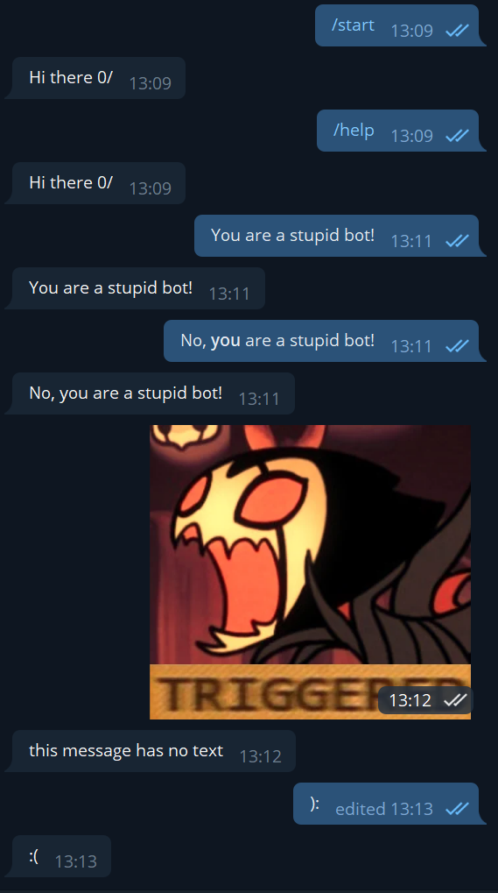

# Echo bot

Simple bot that answers on commands `start` and `help` with `Hi there 0/`, and answers ony other message with it's text.

## Running

Execute this command with `TOKEN` replaced by bot token, in the repository's root directory to run this sample:

```bash
./gradlew :examples:echobot:run --args="TOKEN"
```  

## What you'll see

After running bot, you can navigate to bot's user in telegram and test it:

