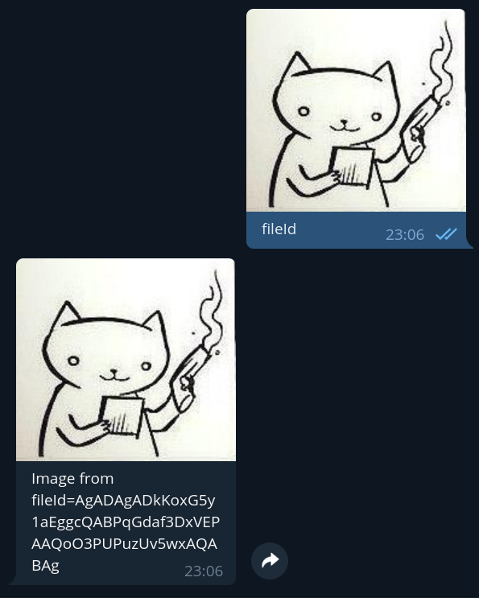

# Files example

This example shows how to work with files.

## Running

Execute this command with `TOKEN` replaced by bot token, in the repository's root directory to run this sample:

```bash
./gradlew :examples:files:run --args="TOKEN"
```  

## What you'll see

After running bot, you can navigate to bot's user in telegram and test it:

### `/url` command

`/url` command is an example of sending files by url


### `/file` command

`/file` command is an example of sending files from disk (in this case from resources)


### `fileId`

This is an example of sending files by fileId. For this method file need to be _already_ on telegram servers, so to test this example you should send photo to the bot with caption "`fileId`".



### `download`

This is an example of downloading files. As in `fileId` example, you should send photo to bot, but now with caption "`download`"


After that, you can see file named `photo.jpg` in yout home dir:

